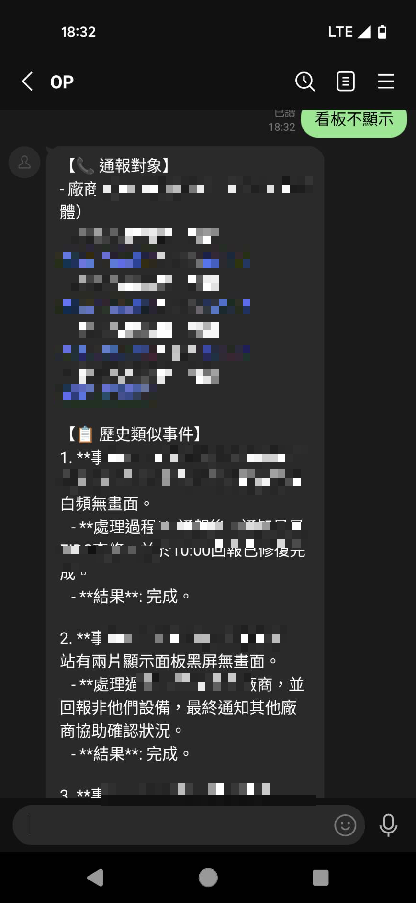
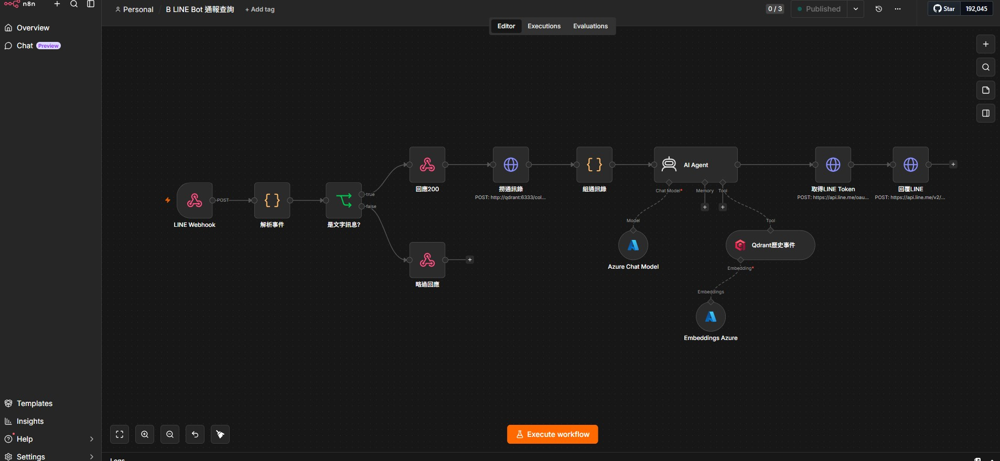
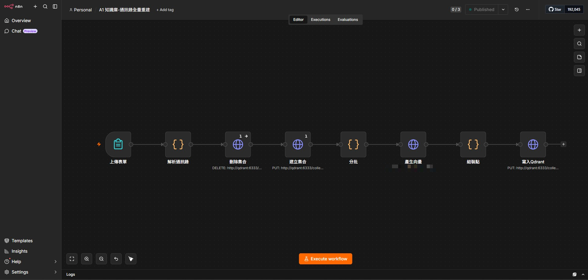
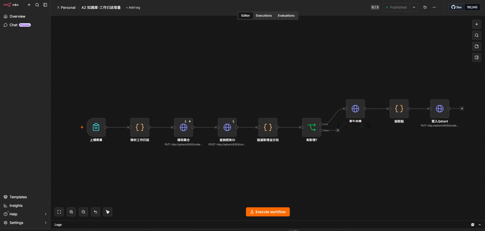

# LINE Bot 通報機器人（Azure + n8n + RAG）

機房值班人員在 LINE 群組輸入問題描述，Bot 透過 RAG 檢索通訊錄與歷史異常通報記錄，由 LLM 整合回答「**該通報誰（姓名/電話/分機）**」與「**過去類似事件怎麼處理**」。

> ⚠️ **本 repo 為展示版**：`sample-data/` 內兩份 Excel 的人名、電話、廠商、事件**全為虛構**（由 [tools/make_demo_data.py](tools/make_demo_data.py) 產生），僅保留與實際運行版相同的檔案格式結構。所有金鑰、網域、資源識別碼皆已移除或改為佔位符。

## 架構

### 知識庫更新路徑（上傳即自動更新）

```
使用者開啟 上傳知識庫.html（本機網頁，內嵌兩個 n8n Form）
       ↓ 選擇 xlsx 直接送入 n8n（不落地雲端儲存體，零儲存成本）
  ├── 通訊錄表單   → Workflow A1：解析檔內最新「通訊錄YYYYMMDD」工作表
  │                  （員工+科別／廠商+負責系統）→ 全量重建 contacts
  └── 工作日誌表單 → Workflow A2：過濾異常通報/資安事件
                     → 確定性 point ID 去重 → 只嵌入新增（增量）
       ↓
Azure OpenAI text-embedding-3-small（1536 維）
       ↓
Qdrant 向量庫（collections: contacts / events）
```

### 查詢回答路徑（LINE Bot）

```
LINE 群組成員發問
       ↓ Webhook POST（HTTPS）
Azure VM Standard_B2pts_v2（ARM64，Docker Compose）
  ├── Caddy（443，唯一對外端口）── Let's Encrypt 自動憑證，反代 n8n
  ├── n8n Workflow B（5678，僅容器網路）
  │     ├ 解析訊息 → 先回 200（LINE 5 秒限制）
  │     ├ AI Agent（gpt-4o-mini）
  │     │   ├ 通訊錄全文注入 system prompt（小表全量比對最準）
  │     │   └ Tool: history_lookup → Qdrant events（向量檢索 topK=8）
  │     └ 簽發 stateless token（15 分鐘）→ LINE Reply API
  └── Qdrant（6333，僅 localhost）
       ↓
LINE 群組收到回覆（通報對象 + 歷史處理案例）
```

## 技術重點

- **混合檢索策略**：小而結構化的通訊錄不走向量檢索、改全文注入 prompt（短文本 chunk 的 dense retrieval 區分度不足，實測正確答案排不進 top-10）；量大且持續成長的工作日誌才用向量 RAG
- **增量去重**：工作日誌每月整份上傳，以內容雜湊產生確定性 point ID，先查 Qdrant 已存在 ID、只對新增事件做 embedding（省成本且冪等）
- **零開放管理端口**：VM 不開 SSH（port 22），維運全走 `az vm run-command`（Azure 控制平面）
- **免費 HTTPS**：Azure VM 免費 DNS（`<label>.<region>.cloudapp.azure.com`）+ Caddy 自動簽 Let's Encrypt 憑證，滿足 LINE Webhook 的 HTTPS 強制要求
- **不存 long-lived token**：LINE 回覆時以 Channel ID/Secret 動態簽發 15 分鐘 stateless token
- **ARM 省成本**：Standard_B2pts_v2（2 vCPU/1GB，約 $6/月），n8n/Qdrant/Caddy 均用官方 arm64 映像
- **基礎設施即程式碼**：VM 以 [cloud-init.yml](cloud-init.yml) 一鍵部署；n8n 工作流以 [tools/build_workflows.py](tools/build_workflows.py)、[tools/update_workflow_b.py](tools/update_workflow_b.py) 透過 API 全自動建立

## 完整建置流程

見 [DEPLOYMENT.md](DEPLOYMENT.md)——含逐步指令與 9 條踩坑記錄（SKU 鎖區、CGNAT、LINE HTTPS 強制、n8n API 細節、429 限流、向量檢索失準的修正等）。

## 範例資料

| 檔案 | 內容 |
|---|---|
| [sample-data/資通處通訊錄(範例).xlsx](sample-data/) | 員工（科別分區、雙欄排版）+ 廠商（含負責系統），格式與實際版一致 |
| [sample-data/資訊機房月工作日誌(範例).xlsx](sample-data/) | 每月一工作表，混合日常巡檢與異常通報事件 |

重新產生：`python tools/make_demo_data.py`

## 實際運行截圖

> 截圖中的真實人名/電話已去識別化處理。

| 畫面 | 截圖 |
|---|---|
| LINE Bot 問答 |  |
| Workflow B：LINE Bot 查詢（AI Agent + 向量工具） |  |
| Workflow A1：通訊錄全量重建 |  |
| Workflow A2：工作日誌增量寫入 |  |

## 成本

約 **$6.3 USD/月**（VM $6 + LLM 用量零頭，LINE Reply 免費），明細見 [DEPLOYMENT.md](DEPLOYMENT.md#8-成本)。
